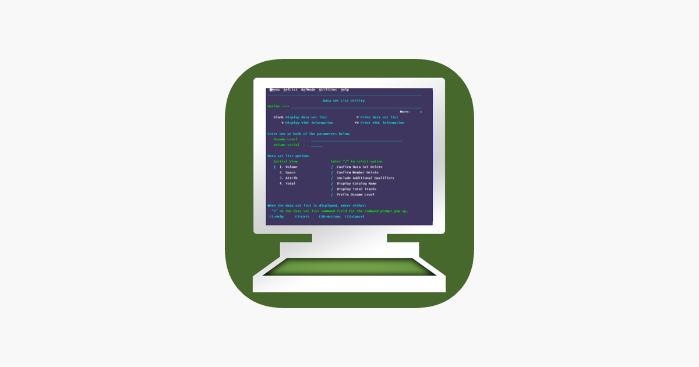

# E-commerce empresa X (h1)

Vamos criar um **e-commerce**, para a *empresa x* bla bla bla

## Funcionalidades: (h2)
_Checkout, **tela de produto**, catalogo, home com banner_

**Checkout, _tela de produto_, catalogo, home com banner**

###### Melhorias de projeto: (h6)
__Melhoria 1__, _melhoria 2_

### Linguagens do projeto:
**Lista simples nao ordenadas (UL)** 
* HTML
* CSS
* Javascript
* PHP

### Linguagens de funcionalidades a desenvolver:
**Lista simples ordenadas (OL)** 
1. Area de membros
    1. Login diferente
    2. Css diferente
2. Integracao com pagamento
3. Sistema de bonus


#### Imagem local



#### Imagem externa


#### Unico Hyperlink direto no Markdown:
https://www.github.com

#### Hyperlink
[Google](https://www.google.com)

#### Hyperlink em imagem
[](https://onepieceex.net/)

## Código da função soma

```javascript
function soma(a, b){
    return a + b;
}
```

```cobol
IDENTIFICATION DIVISION.
01 TESTE PIC X(9) VALUE SPACES.
```


## Lista de tarefas - task list
- [x] Area de membros
- [ ] Integracao com outros pagamentos
- [ ] Sistema de bonus
- [x] CSS do rodape